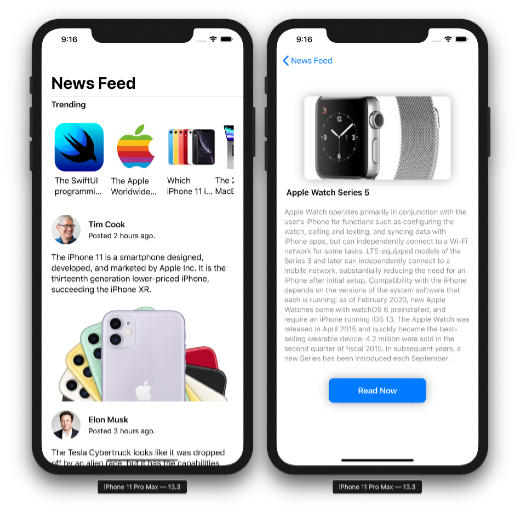

#  FaceBook UI

### I went ahead and built out UI that is very similar to apps on the AppStore today. Namely, a layout that has a horizontal header with a vertical list below it.

- [x] NavigationView
- [x] List

#### ScreenShots of the app.

---

Source of the project: [Lets Build That App](https://www.youtube.com/watch?v=7QgPpvqTfeo)
